# Supporting figures and analysis code for our two-nucleon calculation with sLapH method

Imgs

Stability

## NN stability 4 a2 0 n2 t 5 20
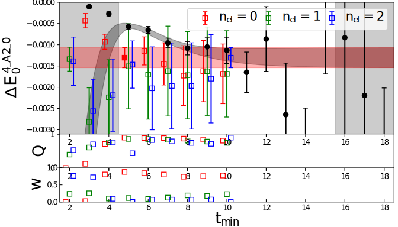

## NN stability 1 a2 1 n2 t 5 20
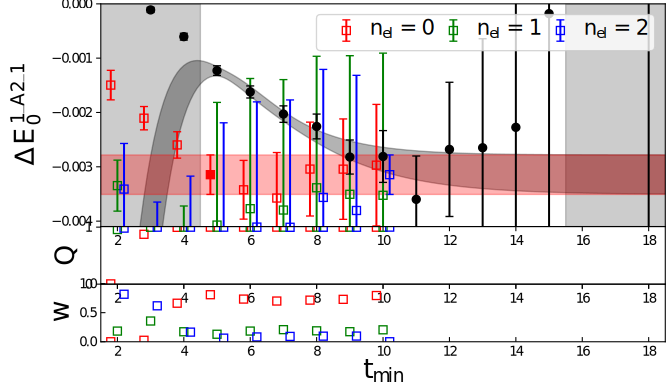

## NN stability 1 e 0 n2 t 5 20
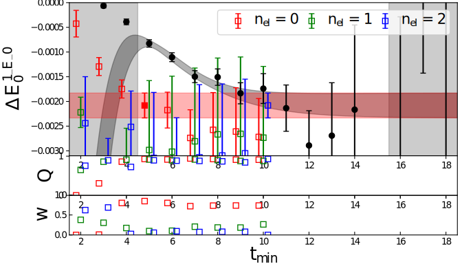

## NN stability 4 a2 1 n2 t 5 20
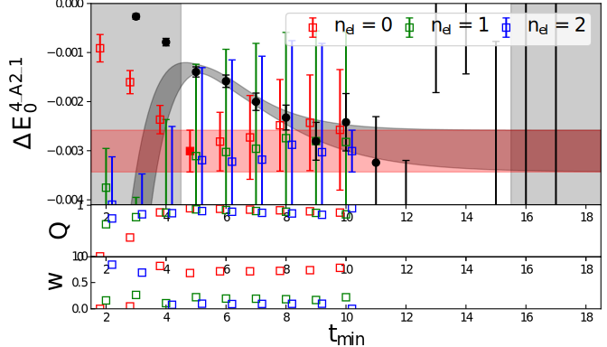

## NN stability 2 b2 0 n2 t 5 20
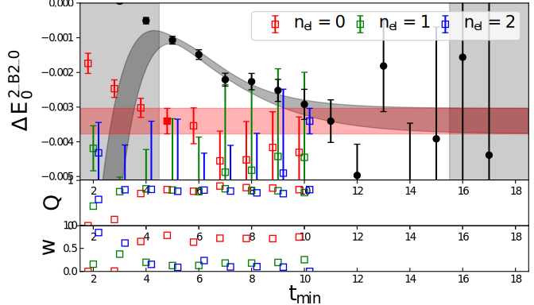

## NN stability 4 e 1 n2 t 5 20
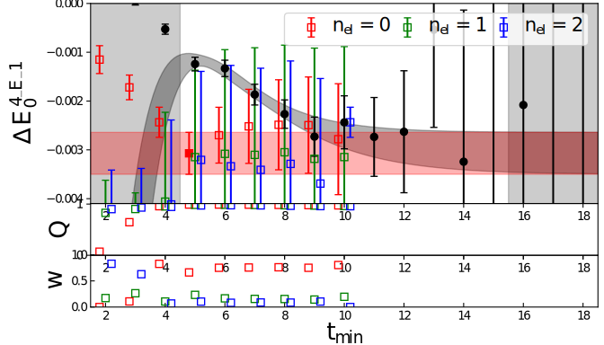

## NN stability 2 b1 0 n2 t 5 20
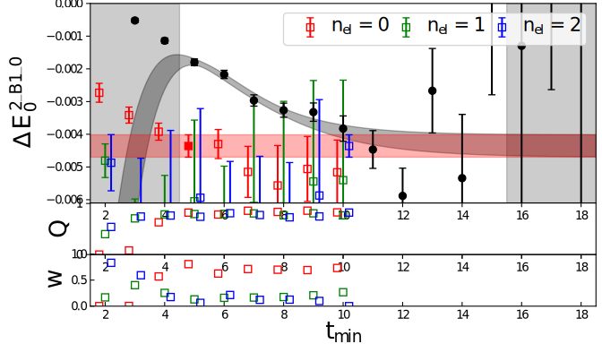

## NN stability 2 a2 0 n2 t 5 20
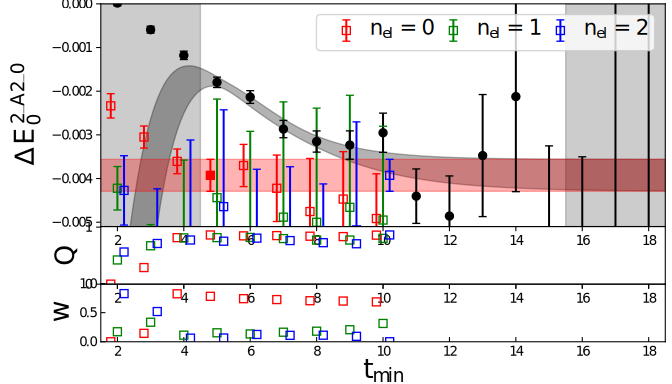

## NN stability 4 e 0 n2 t 5 20
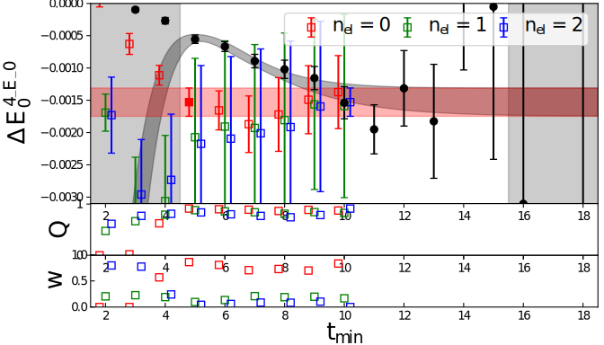

## NN stability 1 e 1 n2 t 5 20
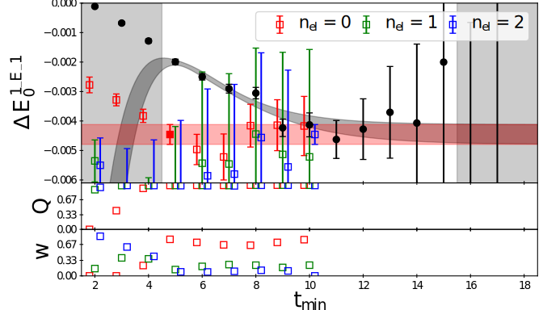

## NN stability 0 t1g 0 n2 t 5 20
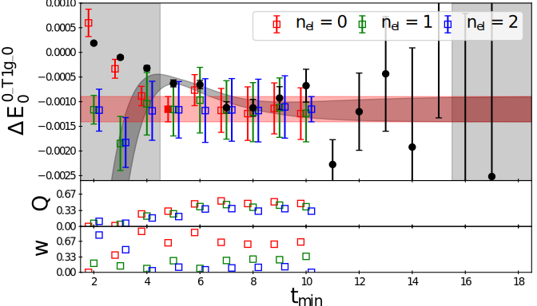

## NN stability 2 b2 3 n2 t 5 20
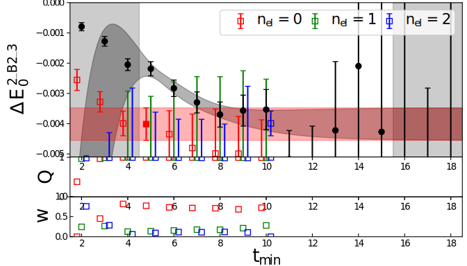

## NN stability 1 a2 0 n2 t 5 20
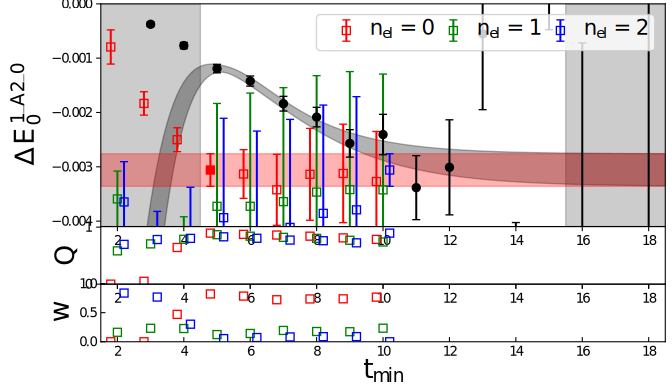

## NN stability 3 a2 0 n2 t 5 20
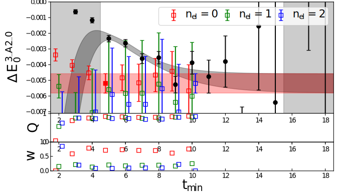

## NN stability 3 e 0 n2 t 5 20

## NN stability 0 t1g 0 n3 t4 20
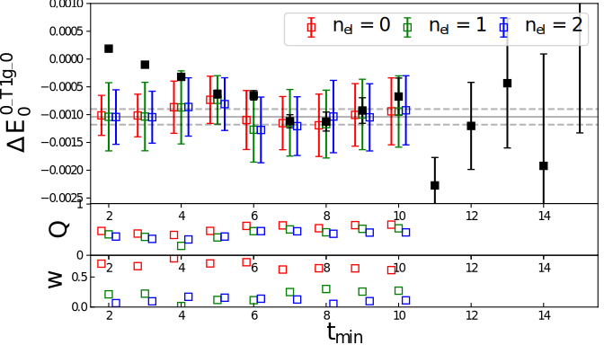

## NN stability 0 t1g 1 n2 t 5 20
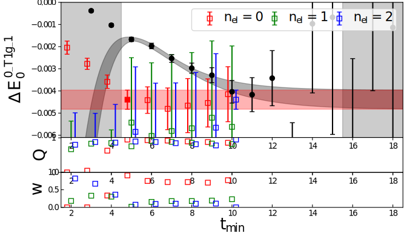
