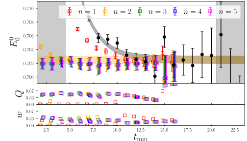
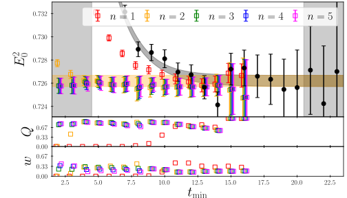
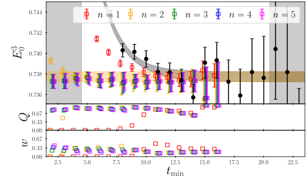
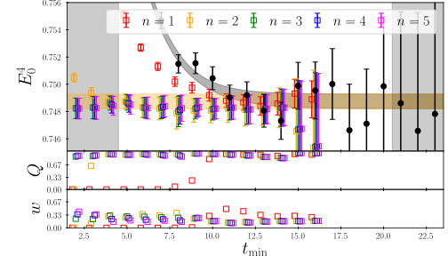

This page shows the single-nucleon effective mass and various fits of the ground state energy for the nucleon at different momenta. The plots are analogous to Fig. 2 in the [paper](https://arxiv.org/pdf/2009.11825.pdf), including momenta larger than zero.

*The ground state energy of the nucleon at q=0*

*The ground state energy of the nucleon at q=1*

*The ground state energy of the nucleon at q=2*

*The ground state energy of the nucleon at q=3*

*The ground state energy of the nucleon at q=4*
